# 🎨 Ad Builder System

<div align="center">


*A modern, scalable ad builder wizard built with Django REST Framework and React TypeScript*

</div>

## 🏗️ System Architecture

```mermaid
graph TB
    subgraph "Client Layer"
        UI[🖥️ React Frontend<br/>TypeScript + Tailwind CSS<br/>Port: 5173]
    end
    
    subgraph "API Gateway"
        NGINX[🌐 Nginx<br/>Reverse Proxy<br/>Static Files]
    end
    
    subgraph "Application Layer"
        API[🔧 Django REST API<br/>Python 3.12<br/>Port: 8001]
        CORS[🔒 CORS Middleware<br/>Cross-Origin Support]
    end
    
    subgraph "Business Logic"
        VIEWS[📊 API Views<br/>StartSession<br/>CollectMeta<br/>CollectScenes<br/>RenderPreview<br/>Confirm]
        MOCK[📝 Mock Data Layer<br/>Deterministic Responses<br/>Prototype Ready]
    end
    
    subgraph "Data Layer"
        MEM[(💾 In-Memory DB<br/>SQLite<br/>Session Storage)]
    end
    
    subgraph "Container Orchestration"
        DOCKER[🐳 Docker Compose<br/>Multi-Container<br/>Development Ready]
    end
    
    UI --> NGINX
    NGINX --> API
    API --> CORS
    CORS --> VIEWS
    VIEWS --> MOCK
    MOCK --> MEM
    DOCKER -.-> UI
    DOCKER -.-> API
    DOCKER -.-> NGINX
    
    classDef frontend fill:#e1f5fe
    classDef backend fill:#f3e5f5
    classDef data fill:#e8f5e8
    classDef infra fill:#fff3e0
    
    class UI,NGINX frontend
    class API,CORS,VIEWS,MOCK backend
    class MEM data
    class DOCKER infra
```



## 🎯 Application Flow Architecture


## 🧩 Frontend Component Architecture

```mermaid
graph TD
    subgraph "🖥️ Frontend Application"
        APP[📱 App.tsx<br/>Router Provider]
        ROUTER[🛣️ Routes<br/>React Router v6]
        
        subgraph "🎭 Wizard Container"
            WIZ[🧙 WizardContainer<br/>State Management<br/>Step Orchestration]
            
            subgraph "📋 Form Components"
                META[📊 MetaForm<br/>Scene Count + Theme]
                SCENE[🎬 SceneForm<br/>Dynamic Scene Builder]
                CONFIRM[✅ ConfirmPane<br/>Approval Interface]
            end
            
            subgraph "📺 Display Components"
                PREVIEW[👀 PreviewPane<br/>Ad Visualization]
                BUTTON[🔘 MinimalButton<br/>Reusable UI Component]
            end
        end
        
        subgraph "🔧 Services & Hooks"
            API[🌐 API Service<br/>Axios Client]
            HOOK[🎣 useAdBuilder<br/>State Management Hook]
        end
        
        subgraph "🎨 Styling"
            TAILWIND[💨 Tailwind CSS<br/>Utility-First Styling]
            INTER[🔤 Inter Font<br/>Modern Typography]
        end
    end
    
    APP --> ROUTER
    ROUTER --> WIZ
    WIZ --> META
    WIZ --> SCENE
    WIZ --> PREVIEW
    WIZ --> CONFIRM
    META --> BUTTON
    SCENE --> BUTTON
    PREVIEW --> BUTTON
    CONFIRM --> BUTTON
    WIZ --> HOOK
    HOOK --> API
    WIZ --> TAILWIND
    TAILWIND --> INTER
    
    classDef container fill:#e3f2fd
    classDef component fill:#f1f8e9
    classDef service fill:#fff8e1
    classDef styling fill:#fce4ec
    
    class APP,ROUTER,WIZ container
    class META,SCENE,PREVIEW,CONFIRM,BUTTON component
    class API,HOOK service
    class TAILWIND,INTER styling
```



## 🔧 Backend API Architecture

```mermaid
graph LR
    subgraph "🌐 HTTP Layer"
        REQ[📥 HTTP Requests<br/>POST/GET]
        CORS[🔒 CORS Middleware<br/>Cross-Origin Headers]
    end
    
    subgraph "🛣️ URL Routing"
        MAIN[🎯 Main URLconf<br/>ad_builder/urls.py]
        ADS[📍 Ads URLconf<br/>ads/urls.py]
    end
    
    subgraph "🎭 View Layer"
        START[🚀 StartSession<br/>POST /start-session/]
        META[📊 CollectMeta<br/>POST /collect-meta/]
        SCENES[🎬 CollectScenes<br/>POST /collect-scenes/]
        PREVIEW[👀 RenderPreview<br/>GET /preview/]
        CONFIRM[✅ Confirm<br/>POST /confirm/]
    end
    
    subgraph "📝 Business Logic"
        MOCK[🎲 Mock Data Generator - mock_data.py - session meta scenes preview final_ad functions]
    end
    
    subgraph "💾 Data Layer"
        MEMORY[(🧠 In-Memory SQLite<br/>Session Storage<br/>No Persistence)]
    end
    
    REQ --> CORS
    CORS --> MAIN
    MAIN --> ADS
    ADS --> START
    ADS --> META
    ADS --> SCENES
    ADS --> PREVIEW
    ADS --> CONFIRM
    START --> MOCK
    META --> MOCK
    SCENES --> MOCK
    PREVIEW --> MOCK
    CONFIRM --> MOCK
    MOCK --> MEMORY
    
    classDef http fill:#ffebee
    classDef routing fill:#e8f5e8
    classDef views fill:#e3f2fd
    classDef logic fill:#fff3e0
    classDef data fill:#f3e5f5
    
    class REQ,CORS http
    class MAIN,ADS routing
    class START,META,SCENES,PREVIEW,CONFIRM views
    class MOCK logic
    class MEMORY data
```



## 🐳 Docker Deployment Architecture

```mermaid
graph TB
    subgraph "🌐 External Access"
        USER[👤 User Browser]
        DEV[💻 Developer]
    end
    
    subgraph "🐳 Docker Compose Environment"
        subgraph "📦 Web Container"
            BUILD1[🏗️ Node Build Stage<br/>npm ci + build]
            NGINX[🌐 Nginx Production<br/>Static File Serving<br/>Port: 5173]
        end
        
        subgraph "📦 API Container"
            PYTHON[🐍 Python 3.12 Alpine]
            DJANGO[🔧 Django Application<br/>Port: 8001]
            DEPS[📚 Dependencies<br/>django~=5.0<br/>djangorestframework<br/>django-cors-headers]
        end
        
        subgraph "🔗 Container Network"
            NETWORK[🌐 Docker Network<br/>Internal Communication]
        end
        
        subgraph "💾 Volume Mounts"
            SRC[📁 Source Code<br/>Live Reload]
            STATIC[📄 Static Files<br/>Built Assets]
        end
    end
    
    USER --> NGINX
    DEV --> DJANGO
    BUILD1 --> NGINX
    NGINX --> NETWORK
    DJANGO --> NETWORK
    PYTHON --> DJANGO
    DJANGO --> DEPS
    SRC --> DJANGO
    STATIC --> NGINX
    
    classDef external fill:#ffebee
    classDef container fill:#e3f2fd
    classDef build fill:#e8f5e8
    classDef network fill:#fff3e0
    classDef storage fill:#f3e5f5
    
    class USER,DEV external
    class BUILD1,NGINX,PYTHON,DJANGO container
    class DEPS build
    class NETWORK network
    class SRC,STATIC storage
```



## 📊 Data Flow Architecture

```mermaid
flowchart TD
    subgraph "📱 User Interface Layer"
        UI[🎨 React Components<br/>Tailwind Styled]
        FORMS[📝 Form Inputs<br/>Controlled Components]
        STATE[🗂️ Component State<br/>useState Hooks]
    end
    
    subgraph "🔗 API Integration Layer"
        HOOK[🎣 useAdBuilder Hook<br/>Custom State Management]
        AXIOS[🌐 Axios HTTP Client<br/>Configured Base URL]
        ERROR[⚠️ Error Handling<br/>Try-Catch Blocks]
    end
    
    subgraph "🌐 Network Layer"
        HTTP[📡 HTTP Requests<br/>REST API Calls]
        JSON[📋 JSON Serialization<br/>Request/Response]
        CORS[🔒 CORS Headers<br/>Cross-Origin Support]
    end
    
    subgraph "🔧 Backend Processing"
        VIEWS[🎭 Django Views<br/>APIView Classes]
        SERIALIZER[🔄 Data Validation<br/>Request Processing]
        MOCK[🎲 Mock Data Engine<br/>Business Logic Simulation]
    end
    
    subgraph "💾 Data Storage"
        MEMORY[(🧠 Session Storage<br/>In-Memory Database)]
        CACHE[⚡ Response Cache<br/>Deterministic Data]
    end
    
    UI --> FORMS
    FORMS --> STATE
    STATE --> HOOK
    HOOK --> AXIOS
    AXIOS --> ERROR
    ERROR --> HTTP
    HTTP --> JSON
    JSON --> CORS
    CORS --> VIEWS
    VIEWS --> SERIALIZER
    SERIALIZER --> MOCK
    MOCK --> MEMORY
    MEMORY --> CACHE
    CACHE -.-> MOCK
    MOCK -.-> SERIALIZER
    SERIALIZER -.-> VIEWS
    VIEWS -.-> CORS
    CORS -.-> JSON
    JSON -.-> HTTP
    HTTP -.-> ERROR
    ERROR -.-> AXIOS
    AXIOS -.-> HOOK
    HOOK -.-> STATE
    STATE -.-> UI
    
    classDef ui fill:#e1f5fe
    classDef integration fill:#e8f5e8
    classDef network fill:#fff3e0
    classDef backend fill:#f3e5f5
    classDef storage fill:#ffebee
    
    class UI,FORMS,STATE ui
    class HOOK,AXIOS,ERROR integration
    class HTTP,JSON,CORS network
    class VIEWS,SERIALIZER,MOCK backend
    class MEMORY,CACHE storage
```



## 🚀 Quick Start

### 🐳 Docker (Recommended)

```bash
# Clone and run with Docker
git clone <repository>
cd test_task
docker compose up --build

# Access the application
# Frontend: http://localhost:5173
# Backend API: http://localhost:8001/api
```

### 💻 Local Development

```bash
# Backend setup
cd backend
pip install "django~=5.0" djangorestframework==3.15.1 django-cors-headers==4.*
python manage.py runserver 8001

# Frontend setup (new terminal)
cd frontend
npm install
npm run dev

# Access URLs
# Frontend: http://localhost:5173
# Backend: http://localhost:8001/api
```

## 📡 API Endpoints

| Method | Endpoint | Description | Response |
|--------|----------|-------------|----------|
| `POST` | `/api/start-session/` | Initialize ad building session | Session ID & state |
| `POST` | `/api/collect-meta/` | Submit ad configuration | Meta validation |
| `POST` | `/api/collect-scenes/` | Submit scene designs | Generated scenes |
| `GET` | `/api/preview/` | Get ad preview | Preview URL & summary |
| `POST` | `/api/confirm/` | Approve or request edits | Final confirmation |

## 🧪 Testing

```bash
# Run Django tests
cd backend
python manage.py test

# Test API endpoints
python ../test_api.py

# Frontend testing
cd frontend
npm run test
```

## 📚 Tech Stack

### 🖥️ Frontend
- **React 18** - Modern UI library
- **TypeScript** - Type-safe development
- **Vite** - Fast build tool and dev server
- **Tailwind CSS** - Utility-first styling
- **React Router v6** - Client-side routing
- **Axios** - HTTP client library

### 🔧 Backend
- **Python 3.12** - Programming language
- **Django 5.0** - Web framework
- **Django REST Framework** - API development
- **django-cors-headers** - Cross-origin support
- **SQLite (in-memory)** - Development database

### 🐳 Infrastructure
- **Docker** - Containerization
- **Docker Compose** - Multi-container orchestration
- **Nginx** - Production web server
- **Alpine Linux** - Lightweight container images

## 🎨 Design System

### 🎯 Design Principles
- **Minimalism** - Clean, uncluttered interface
- **Consistency** - Uniform design patterns
- **Accessibility** - WCAG compliant
- **Responsiveness** - Mobile-first approach

### 🎨 Color Palette
```css
/* Primary Colors */
--accent: #2563eb;        /* Blue accent */
--gray-50: #f9fafb;       /* Light background */
--gray-300: #d1d5db;      /* Borders */
--gray-600: #4b5563;      /* Secondary text */
--gray-900: #111827;      /* Primary text */
```

### 🔤 Typography
- **Primary Font**: Inter (Google Fonts)
- **Fallback**: system-ui, sans-serif
- **Weights**: 300, 400, 500, 600, 700

## 🔮 Future Enhancements

```mermaid
mindmap
  root((🚀 Future Features))
    🔐 Authentication
      JWT Tokens
      User Sessions
      Role Management
    💾 Persistence
      PostgreSQL
      Redis Cache
      File Storage
    ☁️ Cloud Integration
      AWS S3
      CDN Support
      Auto Scaling
    🤖 AI Features
      Scene Generation
      Copy Writing
      A/B Testing
    📊 Analytics
      User Tracking
      Performance Metrics
      Conversion Analysis
```



## 📄 License

MIT License - see [LICENSE](LICENSE) file for details.

## 🤝 Contributing

1. Fork the repository
2. Create a feature branch
3. Make your changes
4. Add tests
5. Submit a pull request

---

<div align="center">

**Built with ❤️ using modern web technologies**

[🏠 Home](/) | [📖 Docs](/docs) | [🐛 Issues](/issues) | [💡 Features](/features)

</div> 